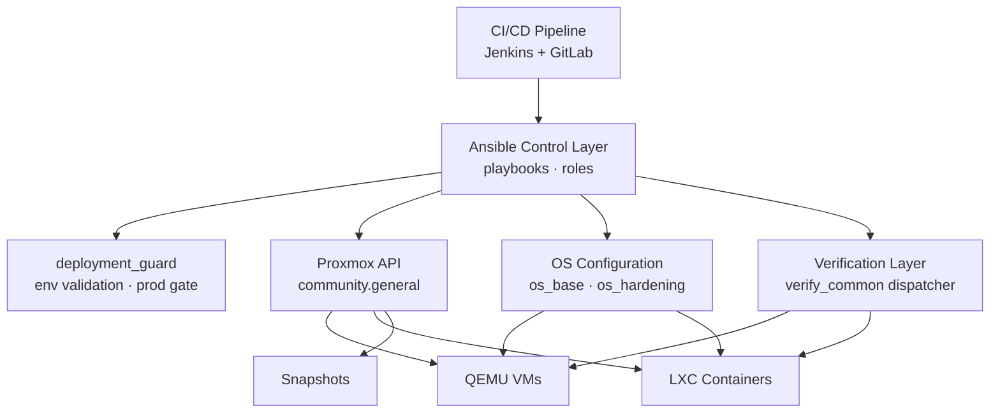
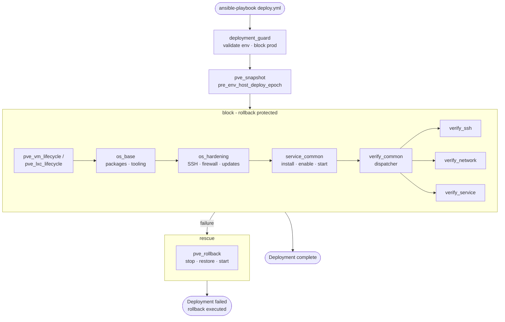
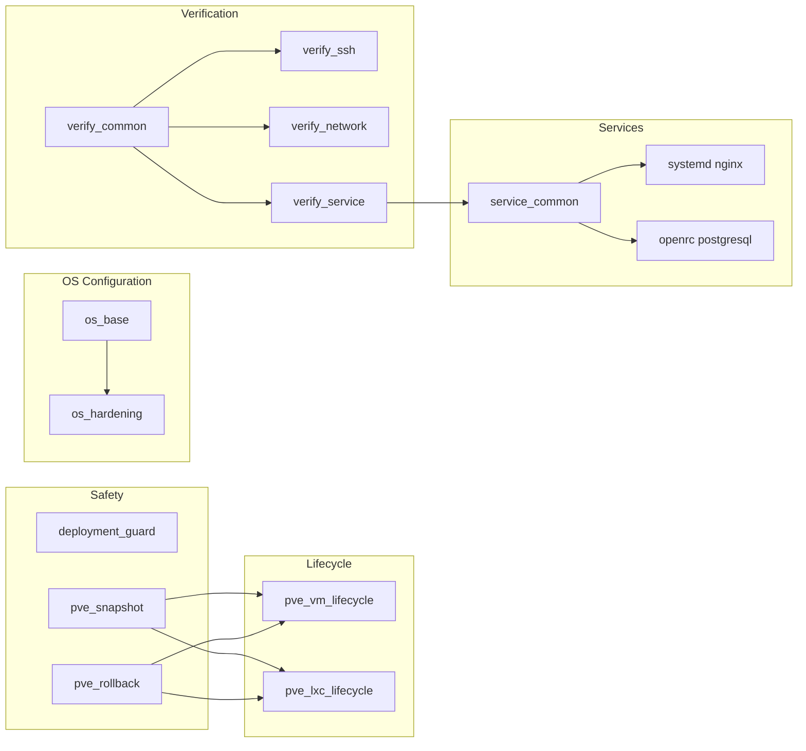
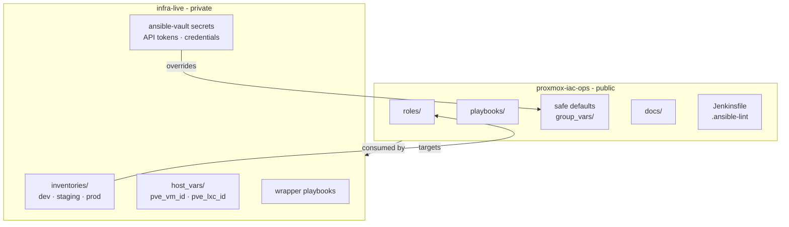
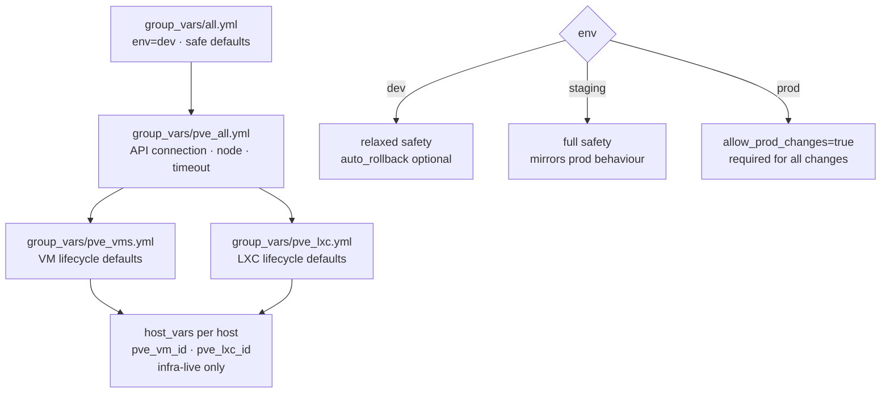
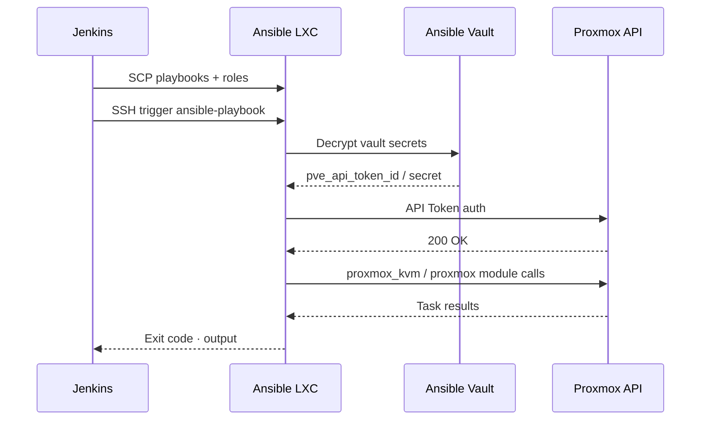

# Architecture Overview

## Purpose
This project provides a reusable Infrastructure-as-Code (IaC) framework for managing workloads on Proxmox VE using Ansible.

It is designed to model real-world platform engineering practices, with a strong focus on:
- Safety
- Modularity
- Reusability
- Lifecycle management
- Environment awareness

## System Overview
The system operates as an orchestration layer on top of Proxmox VE, managing both virtual machines and LXC containers through the Proxmox API.

## Deployment Flow
A deployment runs as a linear sequence with a built-in rescue path. Every risky operation is bracketed by a snapshot and a rollback handler.

## Role Map
Roles are organised into five functional layers. Arrows indicate composition - a role at the head includes or depends on the role at the tail.

## Repository Model
Logic and secrets are separated across two repositories. This repository contains everything that is safe to be public. Infrastructure-specific data lives in a private repository that is never published.

## Environment Model
Three environments are supported. Each inherits from the one above it in the hierarchy and overrides only what differs.

## Authentication Model
Authentication to Proxmox is performed exclusively via API tokens. Credentials are stored in Ansible Vault in the private repository and are never present in this repository.

## Operating System Support
OS differences are handled via conditional includes within roles. No role assumes a specific init system or package manager.

| Concern             | Debian 13                 | Alpine Linux            |
|---------------------|---------------------------|-------------------------|
| Package manager     | `apt`                     | `community.general.apk` |
| Init system         | systemd                   | openrc                  |
| Service check       | `ansible.builtin.systemd` | `rc-service status`     |
| Firewall            | ufw                       | iptables                |
| Auto updates        | unattended-upgrades       | -                       |

## Design Goals
- Clarity over cleverness
- Safety over speed
- Modularity over monoliths

Intentionally designed to reflect real-world infrastructure engineering practices rather than minimal examples.
